# 📊 Qonfido RAG System - Data Flow Diagrams

> **Visual representation of data movement through the RAG system**  

> **Format:** Mermaid diagrams (render in GitHub, VS Code, or Mermaid Live Editor)

---

## 📋 Table of Contents

1. [High-Level System Overview](#1-high-level-system-overview)

2. [Backend RAG Pipeline Flow](#2-backend-rag-pipeline-flow)

3. [Hybrid Search Flow (Parallel Retrieval)](#3-hybrid-search-flow-parallel-retrieval)

4. [Frontend Chat Flow](#4-frontend-chat-flow)

5. [Fund Explorer Flow](#5-fund-explorer-flow)

6. [Data Ingestion & Indexing Flow](#6-data-ingestion--indexing-flow)

7. [Query Processing Flow (Detailed)](#7-query-processing-flow-detailed)

8. [Database & Cache Flow](#8-database--cache-flow)

9. [Complete End-to-End Flow](#9-complete-end-to-end-flow)

10. [Response Generation Flow](#10-response-generation-flow)

---

## 1. High-Level System Overview


---

## 2. Backend RAG Pipeline Flow


---

## 3. Hybrid Search Flow (Parallel Retrieval)

```mermaid
flowchart TD
    START([Query + Embedding]) --> HYBRID_INIT[Initialize HybridSearcher<br/>use_parallel=True]

    HYBRID_INIT --> EXECUTOR[Create ThreadPoolExecutor<br/>max_workers=2]

    EXECUTOR --> PARALLEL_START[Start Parallel Execution<br/>Both searches simultaneously]

    subgraph ParallelExecution ["⚡ PARALLEL SEARCH"]
        direction TB
        
        PARALLEL_START --> THREAD1[Thread 1:<br/>Lexical Search]
        PARALLEL_START --> THREAD2[Thread 2:<br/>Semantic Search]
        
        THREAD1 --> BM25_RUN[Run BM25 Search<br/>rank-bm25 library<br/>Keyword matching]
        THREAD2 --> CHROMA_RUN[Run ChromaDB Search<br/>Cosine similarity<br/>Vector matching]
        
        BM25_RUN --> LEX_WAIT[Wait for<br/>Completion]
        CHROMA_RUN --> SEM_WAIT[Wait for<br/>Completion]
        
        LEX_WAIT --> LEX_RESULTS[Lexical Results<br/>Ranked by BM25 score]
        SEM_WAIT --> SEM_RESULTS[Semantic Results<br/>Ranked by similarity]
    end

    LEX_RESULTS --> WAIT_BOTH[Wait for Both<br/>Threads Complete]
    SEM_RESULTS --> WAIT_BOTH

    WAIT_BOTH --> BUILD_MAPS[Build Result Maps<br/>ID → Rank mapping]

    BUILD_MAPS --> UNIQUE_IDS[Get All Unique<br/>Document IDs]

    UNIQUE_IDS --> CALC_RRF[Calculate RRF Scores<br/>For each document]

    subgraph RRFFormula ["📐 RRF Formula"]
        direction LR
        RRF_FORMULA[RRF_score =<br/>(1-α) × 1/(k+lexical_rank) +<br/>α × 1/(k+semantic_rank)]
        RRF_PARAMS[k=60, α=0.5<br/>Default values]
    end

    CALC_RRF --> RRF_FORMULA
    RRF_FORMULA --> RRF_PARAMS
    RRF_PARAMS --> MERGE[Merge Results<br/>Combine scores]

    MERGE --> SORT[Sort by RRF Score<br/>Descending order]

    SORT --> TOP_K[Return Top K<br/>Results]

    TOP_K --> OUTPUT([📤 Hybrid Search Results<br/>With both scores])

    %% Performance Note
    PARALLEL_START -.->|40-50% faster| OUTPUT

    %% Styling
    classDef inputStyle fill:#e1f5ff,stroke:#01579b,stroke-width:3px
    classDef parallelStyle fill:#fff9c4,stroke:#f57f17,stroke-width:3px
    classDef threadStyle fill:#f3e5f5,stroke:#6a1b9a,stroke-width:2px
    classDef rrfStyle fill:#e8f5e9,stroke:#2e7d32,stroke-width:2px
    classDef outputStyle fill:#c8e6c9,stroke:#2e7d32,stroke-width:3px

    class START inputStyle
    class HYBRID_INIT,EXECUTOR,PARALLEL_START,WAIT_BOTH parallelStyle
    class THREAD1,THREAD2,BM25_RUN,CHROMA_RUN,LEX_WAIT,SEM_WAIT threadStyle
    class BUILD_MAPS,UNIQUE_IDS,CALC_RRF,RRF_FORMULA,RRF_PARAMS,MERGE,SORT rrfStyle
    class TOP_K,OUTPUT outputStyle
```

---

## 4. Frontend Chat Flow

```mermaid
flowchart TD
    START([User Opens<br/>/chat Page]) --> INIT[Initialize Chat Page<br/>Suspense Wrapper]

    INIT --> URL_CHECK{URL has<br/>query param?}

    URL_CHECK -->|Yes ?q=query| LOAD_QUERY[Load Query from URL<br/>useSearchParams]
    URL_CHECK -->|No| WELCOME[Show Welcome Message<br/>WelcomeMessage Component]

    LOAD_QUERY --> CHECK_PROCESSED{Already<br/>Processed?}

    CHECK_PROCESSED -->|No| PREVENT_DOUBLE[Set hasProcessedQuery<br/>useRef flag]
    PREVENT_DOUBLE --> SEND_QUERY
    CHECK_PROCESSED -->|Yes| WELCOME

    WELCOME --> USER_INPUT[User Types Query<br/>ChatInput Component]

    USER_INPUT --> SEARCH_MODE{Select<br/>Search Mode?}

    SEARCH_MODE -->|Lexical| MODE_LEX[Set Mode:<br/>lexical]
    SEARCH_MODE -->|Semantic| MODE_SEM[Set Mode:<br/>semantic]
    SEARCH_MODE -->|Hybrid| MODE_HYB[Set Mode:<br/>hybrid]

    MODE_LEX --> SUBMIT
    MODE_SEM --> SUBMIT
    MODE_HYB --> SUBMIT

    USER_INPUT --> SUBMIT[User Submits<br/>Enter or Button]

    SUBMIT --> CREATE_USER_MSG[Create User Message<br/>ChatMessage Object]

    CREATE_USER_MSG --> CREATE_AI_MSG[Create AI Message<br/>with isLoading=true]

    CREATE_AI_MSG --> ADD_MESSAGES[Add to Messages Array<br/>State Update]

    ADD_MESSAGES --> SCROLL[Auto-scroll to Bottom<br/>scrollRef]

    SCROLL --> API_CALL[Call Backend API<br/>lib/api.ts → sendQuery]

    API_CALL --> LOADING[Show Loading State<br/>Loader2 Spinner]

    subgraph BackendCall ["🌐 API CALL"]
        direction TB
        LOADING --> POST[POST /api/v1/query<br/>with search_mode]
        POST --> WAIT[Wait for Response<br/>~1.5-4 seconds]
        WAIT --> RESPONSE[Receive QueryResponse<br/>JSON]
    end

    RESPONSE --> CHECK_ERROR{Error?}

    CHECK_ERROR -->|Yes| ERROR_HANDLE[Show Error Message<br/>Display in ChatMessage]
    CHECK_ERROR -->|No| PARSE[Parse Response<br/>Extract Data]

    PARSE --> TRANSFORM[Transform Data<br/>for Display]

    subgraph TransformData ["🔄 DATA TRANSFORMATION"]
        direction TB
        TRANSFORM --> FUNDS_DATA[Extract Funds<br/>FundInfo[]]
        TRANSFORM --> CITATIONS[Create Citations<br/>MessageCitation[]]
        TRANSFORM --> CONF[Extract Confidence<br/>Number]
        TRANSFORM --> QUERY_TYPE[Extract Query Type<br/>faq/numerical/hybrid]
    end

    FUNDS_DATA --> UPDATE_MSG[Update AI Message<br/>Replace isLoading]
    CITATIONS --> UPDATE_MSG
    CONF --> UPDATE_MSG
    QUERY_TYPE --> UPDATE_MSG

    UPDATE_MSG --> RENDER[Render ChatMessage<br/>Component]

    subgraph MessageRendering ["🎨 MESSAGE RENDERING"]
        direction TB
        RENDER --> MSG_CONTENT[Display Text Content<br/>AI Response]
        RENDER --> FUND_CARDS{Funds<br/>Available?}
        FUND_CARDS -->|Yes| FUND_GRID[FundAnalysisResults<br/>Grid of FundInsightCard]
        FUND_CARDS -->|No| SKIP_FUNDS
        FUND_GRID --> METRICS[Display Metrics<br/>CAGR, Sharpe, Volatility]
        METRICS --> SKIP_FUNDS[Skip Fund Display]
        SKIP_FUNDS --> CITATIONS_CHIP{Citations<br/>Available?}
        CITATIONS_CHIP -->|Yes| CIT_CHIPS[CitationChip Components<br/>Source Badges]
        CITATIONS_CHIP -->|No| DONE
        CIT_CHIPS --> DONE[Complete]
    end

    MSG_CONTENT --> FUND_CARDS
    DONE --> SCROLL_BOTTOM[Scroll to Bottom<br/>After Render]

    ERROR_HANDLE --> END
    SCROLL_BOTTOM --> END([✅ Complete])

    %% Styling
    classDef inputStyle fill:#e1f5ff,stroke:#01579b,stroke-width:3px
    classDef processStyle fill:#fff9c4,stroke:#f57f17,stroke-width:2px
    classDef apiStyle fill:#ffebee,stroke:#c62828,stroke-width:2px
    classDef renderStyle fill:#f3e5f5,stroke:#6a1b9a,stroke-width:2px
    classDef outputStyle fill:#c8e6c9,stroke:#2e7d32,stroke-width:3px
    classDef decisionStyle fill:#e1bee7,stroke:#6a1b9a,stroke-width:2px

    class START,USER_INPUT inputStyle
    class INIT,CREATE_USER_MSG,CREATE_AI_MSG,ADD_MESSAGES,SCROLL,TRANSFORM processStyle
    class API_CALL,LOADING,POST,WAIT,RESPONSE apiStyle
    class RENDER,MSG_CONTENT,FUND_GRID,METRICS,CIT_CHIPS renderStyle
    class END outputStyle
    class URL_CHECK,CHECK_PROCESSED,SEARCH_MODE,CHECK_ERROR,FUND_CARDS,CITATIONS_CHIP decisionStyle
```

---

## 5. Fund Explorer Flow

```mermaid
flowchart TD
    START([User Opens<br/>/funds Page]) --> INIT[Initialize Funds Page<br/>useState hooks]

    INIT --> LOAD_FUNDS[Fetch Funds from API<br/>getFunds()]

    LOAD_FUNDS --> API_CALL[GET /api/v1/funds<br/>Backend API]

    API_CALL --> LOADING[Show Loading State<br/>Loader2 Spinner]

    LOADING --> RESPONSE[Receive FundListResponse<br/>funds[] + total]

    RESPONSE --> SET_STATE[Set Funds State<br/>useState update]

    SET_STATE --> RENDER_UI[Render UI<br/>Fund Cards Grid]

    RENDER_UI --> USER_ACTION{User<br/>Action?}

    USER_ACTION -->|Search| SEARCH_INPUT[User Types<br/>in Search Box]

    USER_ACTION -->|Filter| FILTER_BUTTON[Click Filter<br/>Category Button]

    USER_ACTION -->|View Fund| FUND_CLICK[Click on<br/>Fund Card]

    USER_ACTION -->|Ask AI| ASK_AI_BUTTON[Click<br/>Ask AI Button]

    SEARCH_INPUT --> CLIENT_FILTER[Client-Side Filtering<br/>Real-time]

    subgraph ClientFiltering ["🔍 CLIENT-SIDE FILTERING"]
        direction TB
        CLIENT_FILTER --> SEARCH_TEXT[Search by:<br/>fund_name, category,<br/>fund_house]
        CLIENT_FILTER --> FILTER_CATEGORY[Filter by:<br/>Category match<br/>Large Cap, Hybrid, etc.]
        SEARCH_TEXT --> COMBINE[Combine Filters<br/>AND logic]
        FILTER_CATEGORY --> COMBINE
        COMBINE --> FILTERED[Filtered Results<br/>Array]
    end

    FILTER_BUTTON --> TOGGLE[Toggle Filter<br/>selectedFilter state]

    TOGGLE --> CLIENT_FILTER

    FILTERED --> UPDATE_GRID[Update Grid Display<br/>React Re-render]

    UPDATE_GRID --> DISPLAY_FUNDS[Display Fund Cards<br/>with Metrics]

    FUND_CLICK --> NAVIGATE[Navigate to<br/>/funds/[fundId]]

    NAVIGATE --> DETAIL_PAGE[Fund Detail Page<br/>Load fund data]

    ASK_AI_BUTTON --> NAVIGATE_CHAT[Navigate to Chat<br/>/chat?q=Tell me about...]

    NAVIGATE_CHAT --> CHAT_PAGE[Chat Page<br/>Pre-filled Query]

    DISPLAY_FUNDS --> LOOP[Wait for Next<br/>User Action]

    LOOP --> USER_ACTION

    DETAIL_PAGE --> DETAIL_FLOW[Detail Page Flow<br/>See Diagram 9]

    CHAT_PAGE --> CHAT_FLOW[Chat Flow<br/>See Diagram 4]

    %% Styling
    classDef inputStyle fill:#e1f5ff,stroke:#01579b,stroke-width:3px
    classDef apiStyle fill:#ffebee,stroke:#c62828,stroke-width:2px
    classDef filterStyle fill:#fff9c4,stroke:#f57f17,stroke-width:2px
    classDef renderStyle fill:#f3e5f5,stroke:#6a1b9a,stroke-width:2px
    classDef actionStyle fill:#e8f5e9,stroke:#2e7d32,stroke-width:2px
    classDef decisionStyle fill:#e1bee7,stroke:#6a1b9a,stroke-width:2px

    class START inputStyle
    class LOAD_FUNDS,API_CALL,LOADING,RESPONSE,SET_STATE apiStyle
    class SEARCH_INPUT,CLIENT_FILTER,SEARCH_TEXT,FILTER_CATEGORY,COMBINE,FILTERED filterStyle
    class RENDER_UI,UPDATE_GRID,DISPLAY_FUNDS renderStyle
    class FUND_CLICK,ASK_AI_BUTTON,NAVIGATE,NAVIGATE_CHAT actionStyle
    class USER_ACTION decisionStyle
```

---

## 6. Data Ingestion & Indexing Flow


---

## 7. Query Processing Flow (Detailed)

```mermaid
flowchart TD
    START([📥 POST /api/v1/query<br/>Request Body]) --> VALIDATE_REQ[Validate Request<br/>Pydantic Schema<br/>QueryRequest]

    VALIDATE_REQ --> INIT_PIPELINE[Get Pipeline Instance<br/>get_pipeline]

    INIT_PIPELINE --> EMBED_QUERY[Embed Query Text<br/>BGE-M3 Model<br/>1024-dim vector]

    EMBED_QUERY --> CACHE_CHECK{Check Cache<br/>Query Embedding?}

    CACHE_CHECK -->|Hit| CACHE_EMBED[Use Cached<br/>Embedding]
    CACHE_CHECK -->|Miss| GEN_EMBED[Generate Embedding<br/>BGE-M3.encode]
    GEN_EMBED --> SAVE_EMBED[Save to Cache<br/>TTL: 24hr]

    CACHE_EMBED --> MODE_CHECK{Search Mode<br/>from Request?}

    SAVE_EMBED --> MODE_CHECK

    MODE_CHECK -->|lexical| LEXICAL_FLOW[Lexical Flow]
    MODE_CHECK -->|semantic| SEMANTIC_FLOW[Semantic Flow]
    MODE_CHECK -->|hybrid| HYBRID_FLOW[Hybrid Flow<br/>See Diagram 3]

    subgraph LexicalFlow ["🔤 LEXICAL FLOW"]
        LEXICAL_FLOW --> TOKENIZE[Tokenize Query<br/>Word segmentation]
        TOKENIZE --> BM25_SEARCH[Search BM25 Index<br/>rank-bm25 library]
        BM25_SEARCH --> BM25_RANK[Rank by BM25 Score<br/>Higher = Better Match]
        BM25_RANK --> BM25_RESULTS[Return Top K Results]
    end

    subgraph SemanticFlow ["🧠 SEMANTIC FLOW"]
        SEMANTIC_FLOW --> CHROMA_QUERY[Query ChromaDB<br/>Collection]
        CHROMA_QUERY --> COSINE_SIM[Calculate Cosine<br/>Similarity]
        COSINE_SIM --> SIM_RANK[Rank by Similarity<br/>0.0 - 1.0]
        SIM_RANK --> SEM_RESULTS[Return Top K Results]
    end

    BM25_RESULTS --> RESULTS
    SEM_RESULTS --> RESULTS
    HYBRID_FLOW --> RESULTS

    RESULTS[Search Results<br/>Document List] --> FILTER{Source<br/>Filter?}

    FILTER -->|faq| FAQ_ONLY[Filter to FAQ<br/>Documents Only]
    FILTER -->|fund| FUND_ONLY[Filter to Fund<br/>Documents Only]
    FILTER -->|null| ALL_RESULTS[Keep All<br/>Results]

    FAQ_ONLY --> RERANK_CHECK
    FUND_ONLY --> RERANK_CHECK
    ALL_RESULTS --> RERANK_CHECK

    RERANK_CHECK{Rerank<br/>Enabled?}

    RERANK_CHECK -->|Yes| RERANK[Cohere Rerank API<br/>Two-stage retrieval<br/>Improve precision]
    RERANK_CHECK -->|No| SKIP_RERANK[Skip Reranking<br/>Use Original Results]

    RERANK --> RERANKED[Top Reranked Results<br/>Better Relevance]
    SKIP_RERANK --> ORIGINAL[Original Results]

    RERANKED --> CLASSIFY
    ORIGINAL --> CLASSIFY

    CLASSIFY[Classify Query Type<br/>Keyword Detection<br/>FAQ / Numerical / Hybrid] --> EXTRACT_FUNDS[Extract Fund Information<br/>From Results Metadata<br/>With Cache Fallback]

    EXTRACT_FUNDS --> FORMAT_CONTEXT[Format Context<br/>For LLM<br/>Include Sources]

    FORMAT_CONTEXT --> SELECT_PROMPT[Select Prompt Template<br/>Based on Query Type<br/>prompts.py]

    SELECT_PROMPT --> LLM_CALL[Call Claude API<br/>claude-3-opus-20240229<br/>System + User Prompt]

    LLM_CALL --> LLM_RESPONSE[Receive LLM Response<br/>Generated Answer<br/>Text Format]

    LLM_RESPONSE --> CALC_CONF[Calculate Confidence<br/>Based on:<br/>- Source scores<br/>- Field completeness<br/>- Query type match]

    CALC_CONF --> BUILD_RESPONSE[Build QueryResponse<br/>Schema Object]

    BUILD_RESPONSE --> RETURN([📤 Return JSON<br/>200 OK])

    %% Error Handling
    VALIDATE_REQ -.->|Invalid| ERROR_VALID[400 Bad Request<br/>Validation Error]
    LLM_CALL -.->|API Error| ERROR_LLM[500 Internal Error<br/>LLM Failed]
    ERROR_VALID --> RETURN
    ERROR_LLM --> RETURN

    %% Styling
    classDef inputStyle fill:#e1f5ff,stroke:#01579b,stroke-width:3px
    classDef validateStyle fill:#fff3e0,stroke:#e65100,stroke-width:2px
    classDef embedStyle fill:#fff9c4,stroke:#f57f17,stroke-width:2px
    classDef searchStyle fill:#f3e5f5,stroke:#6a1b9a,stroke-width:2px
    classDef llmStyle fill:#ffebee,stroke:#c62828,stroke-width:2px
    classDef outputStyle fill:#c8e6c9,stroke:#2e7d32,stroke-width:3px
    classDef errorStyle fill:#ffcdd2,stroke:#b71c1c,stroke-width:2px
    classDef decisionStyle fill:#e1bee7,stroke:#6a1b9a,stroke-width:2px

    class START inputStyle
    class VALIDATE_REQ validateStyle
    class EMBED_QUERY,CACHE_CHECK,GEN_EMBED,SAVE_EMBED embedStyle
    class LEXICAL_FLOW,SEMANTIC_FLOW,HYBRID_FLOW,TOKENIZE,BM25_SEARCH,CHROMA_QUERY searchStyle
    class LLM_CALL,LLM_RESPONSE,CALC_CONF llmStyle
    class BUILD_RESPONSE,RETURN outputStyle
    class ERROR_VALID,ERROR_LLM errorStyle
    class MODE_CHECK,FILTER,RERANK_CHECK decisionStyle
```



---

## 8. Database & Cache Flow

```mermaid
flowchart TD
    subgraph Input ["📥 INPUT"]
        QUERY_EMBED[Query Embedding<br/>1024-dim vector]
        DOCUMENTS[Documents<br/>Text + Metadata]
        QUERY_RESULT[Query Response<br/>QueryResponse object]
    end

    subgraph EmbeddingCache ["🔵 EMBEDDING CACHE"]
        CHECK_EMBED{Query Embedding<br/>in Cache?}
        CHECK_EMBED -->|Hit| GET_EMBED[Return Cached<br/>Embedding<br/>~10ms]
        CHECK_EMBED -->|Miss| STORE_EMBED[Generate & Store<br/>TTL: 24 hours]
    end

    subgraph QueryCache ["🟢 QUERY CACHE"]
        CHECK_QUERY{Query + Mode<br/>in Cache?}
        CHECK_QUERY -->|Hit| GET_QUERY[Return Cached<br/>Response<br/>~50ms]
        CHECK_QUERY -->|Miss| STORE_QUERY[Store Response<br/>TTL: 5 minutes]
    end

    subgraph ChromaDB ["💜 CHROMADB VECTOR STORE"]
        CHROMA_WRITE[Write Documents<br/>with Embeddings]
        CHROMA_READ[Read Similar<br/>Documents]
        CHROMA_CLEAR[Clear Collection<br/>on Re-index]
    end

    subgraph BM25Index ["🟡 BM25 LEXICAL INDEX"]
        BM25_WRITE[Index Documents<br/>Tokenized]
        BM25_READ[Search Index<br/>BM25 Scoring]
        BM25_CLEAR[Clear Index<br/>on Re-index]
    end

    subgraph SQLite ["🗄️ SQLITE DATABASE"]
        direction TB
        DB_WRITE[Write Metadata<br/>Funds, FAQs]
        DB_READ[Read Metadata<br/>Fast Lookup]
        DB_CLEAR[Clear Tables<br/>Optional]
    end

    QUERY_EMBED --> CHECK_EMBED
    DOCUMENTS --> CHROMA_WRITE
    DOCUMENTS --> BM25_WRITE
    DOCUMENTS --> DB_WRITE

    GET_EMBED --> CHROMA_READ
    GET_EMBED --> BM25_READ

    CHROMA_READ --> RESULTS
    BM25_READ --> RESULTS

    RESULTS[Search Results] --> CHECK_QUERY

    QUERY_RESULT --> STORE_QUERY

    STORE_EMBED --> CHROMA_WRITE

    subgraph CacheStrategy ["⚙️ CACHE STRATEGY"]
        direction LR
        STRATEGY["Embedding Cache:<br/>Hash(embedding) → Vector<br/>Query Cache:<br/>Hash(query+mode+top_k) → Response"]
        TTL["TTL:<br/>Embeddings: 24hr<br/>Queries: 5min"]
    end

    CHECK_EMBED -.->|Cache Miss| STRATEGY
    CHECK_QUERY -.->|Cache Miss| STRATEGY

    %% Performance Metrics
    GET_EMBED -.->|Performance| FAST_EMBED["⚡ 10ms<br/>vs 50ms"]
    GET_QUERY -.->|Performance| FAST_QUERY["⚡ 50ms<br/>vs 2-4s"]

    %% Styling
    classDef inputStyle fill:#e1f5ff,stroke:#01579b,stroke-width:2px
    classDef cacheStyle fill:#fff9c4,stroke:#f57f17,stroke-width:2px
    classDef storageStyle fill:#f3e5f5,stroke:#6a1b9a,stroke-width:2px
    classDef dbStyle fill:#e8f5e9,stroke:#2e7d32,stroke-width:2px
    classDef perfStyle fill:#ffebee,stroke:#c62828,stroke-width:1px,stroke-dasharray: 5 5
    classDef decisionStyle fill:#e1bee7,stroke:#6a1b9a,stroke-width:2px

    class QUERY_EMBED,DOCUMENTS,QUERY_RESULT inputStyle
    class CHECK_EMBED,GET_EMBED,STORE_EMBED,CHECK_QUERY,GET_QUERY,STORE_QUERY cacheStyle
    class CHROMA_WRITE,CHROMA_READ,CHROMA_CLEAR,BM25_WRITE,BM25_READ,BM25_CLEAR storageStyle
    class DB_WRITE,DB_READ,DB_CLEAR dbStyle
    class FAST_EMBED,FAST_QUERY perfStyle
    class CHECK_EMBED,CHECK_QUERY decisionStyle
```



---

## 9. Complete End-to-End Flow

```mermaid
flowchart TD
    START([👤 USER]) -->|Visits| HOMEPAGE[Homepage<br/>Landing Page<br/>page.tsx]

    HOMEPAGE --> ACTION{User<br/>Action?}

    ACTION -->|Search Query| CHAT_PAGE[Chat Page<br/>/chat]
    ACTION -->|Browse Funds| FUNDS_PAGE[Fund Explorer<br/>/funds]

    subgraph ChatFlow ["💬 CHAT FLOW"]
        CHAT_PAGE --> USER_TYPES[User Types Query<br/>"Best Sharpe ratio funds"]
        USER_TYPES --> SELECT_MODE[Select Search Mode<br/>Lexical/Semantic/Hybrid]
        SELECT_MODE --> SUBMIT[Submit Query<br/>ChatInput Component]
        SUBMIT --> FRONTEND_API[Frontend API Call<br/>lib/api.ts]
    end

    subgraph FundsFlow ["📊 FUNDS FLOW"]
        FUNDS_PAGE --> LOAD_FUNDS[Load Funds<br/>GET /api/v1/funds]
        LOAD_FUNDS --> DISPLAY_GRID[Display Grid<br/>Fund Cards]
        DISPLAY_GRID --> USER_CLICKS{User<br/>Action?}
        USER_CLICKS -->|Ask AI| NAV_TO_CHAT[Navigate to Chat<br/>with Pre-filled Query]
        USER_CLICKS -->|View Details| NAV_TO_DETAIL[Fund Detail Page<br/>/funds/[fundId]]
        NAV_TO_CHAT --> CHAT_PAGE
    end

    FRONTEND_API --> BACKEND_API[Backend API<br/>FastAPI Endpoint<br/>POST /api/v1/query]

    subgraph BackendProcessing ["⚙️ BACKEND PROCESSING"]
        BACKEND_API --> RAG_PIPELINE[RAG Pipeline<br/>pipeline.py]
        RAG_PIPELINE --> EMBED[Embed Query<br/>BGE-M3]
        EMBED --> SEARCH[Hybrid Search<br/>Parallel Retrieval]
        SEARCH --> RETRIEVE[Retrieve Documents<br/>FAQs + Funds]
        RETRIEVE --> RERANK[Rerank Results<br/>Cohere API]
        RERANK --> GENERATE[Generate Answer<br/>Claude API]
        GENERATE --> RESPONSE[Build Response<br/>QueryResponse]
    end

    RESPONSE --> FRONTEND_RECV[Frontend Receives<br/>Response JSON]

    FRONTEND_RECV --> PARSE_RESPONSE[Parse Response<br/>Extract Data]

    PARSE_RESPONSE --> DISPLAY_ANSWER[Display Answer<br/>ChatMessage Component]

    DISPLAY_ANSWER --> DISPLAY_FUNDS{Funds<br/>in Response?}

    DISPLAY_FUNDS -->|Yes| FUND_CARDS[Fund Analysis Results<br/>Grid of Cards<br/>CAGR, Sharpe, Volatility]
    DISPLAY_FUNDS -->|No| SKIP_CARDS

    FUND_CARDS --> CITATIONS[Display Citations<br/>Source Badges]
    SKIP_CARDS --> CITATIONS

    CITATIONS --> END_CHAT([✅ Complete])

    subgraph DataFlow ["📊 DATA FLOW"]
        direction TB
        CSV[CSV Files<br/>faqs.csv, funds.csv] --> INGEST[Data Ingestion<br/>Startup]
        INGEST --> EMBEDDINGS[Generate Embeddings<br/>BGE-M3 Model]
        EMBEDDINGS --> CHROMADB[(ChromaDB<br/>Vector Store)]
        EMBEDDINGS --> BM25[BM25 Index<br/>Lexical]
        CHROMADB --> SEARCH
        BM25 --> SEARCH
    end

    CSV --> INGEST

    %% Styling
    classDef userStyle fill:#c8e6c9,stroke:#2e7d32,stroke-width:3px
    classDef frontendStyle fill:#f3e5f5,stroke:#6a1b9a,stroke-width:2px
    classDef backendStyle fill:#fff9c4,stroke:#f57f17,stroke-width:2px
    classDef storageStyle fill:#e8f5e9,stroke:#2e7d32,stroke-width:2px
    classDef dataStyle fill:#e1f5ff,stroke:#01579b,stroke-width:2px
    classDef decisionStyle fill:#e1bee7,stroke:#6a1b9a,stroke-width:2px

    class START,END_CHAT userStyle
    class HOMEPAGE,CHAT_PAGE,FUNDS_PAGE,USER_TYPES,SELECT_MODE,SUBMIT,FRONTEND_API,FRONTEND_RECV,PARSE_RESPONSE,DISPLAY_ANSWER,FUND_CARDS,CITATIONS frontendStyle
    class BACKEND_API,RAG_PIPELINE,EMBED,SEARCH,RETRIEVE,RERANK,GENERATE,RESPONSE backendStyle
    class CHROMADB,BM25 storageStyle
    class CSV,INGEST,EMBEDDINGS dataStyle
    class ACTION,USER_CLICKS,DISPLAY_FUNDS decisionStyle
```

---

## 10. Response Generation Flow


---

## 🎯 Quick Reference Summary

### Data Transformation Chain

```
CSV Files → Documents → Embeddings → Vector Index → Search → LLM → Response → UI
```

### Key Decision Points

1. **Which Search Mode?** Lexical (fast, exact) / Semantic (contextual) / Hybrid (best)
2. **Use Cache?** Check embedding cache → Check query cache
3. **Parallel Retrieval?** Hybrid search uses ThreadPoolExecutor for 40-50% speedup
4. **Rerank?** Optional Cohere reranking for better precision
5. **Valid Response?** Confidence score calculation and validation

### Performance Flow

```
User Query → Embed (50ms) → Search (20-100ms) → Rerank (200ms) → LLM (1-3s) → Response
              ↓ Cache Hit
           10ms              ↓ Cache Hit
                         50ms
```

### Cost Flow (Hybrid Search)

```
80% → Tier 1 (Regex) - FREE
15% → Tier 2 (LayoutLMv3) - FREE  
4%  → Tier 3 (OCR+LLM) - ~$0.01
1%  → Tier 4 (Vision) - ~$0.05
────────────────────────────────
Average: ~$0.005 per query
```

---

## 📖 How to View These Diagrams

### Option 1: GitHub (Automatic Rendering)

1. Push to GitHub
2. Open this file - diagrams render automatically

### Option 2: VS Code (With Extension)

1. Install "Markdown Preview Mermaid Support" extension
2. Open this file
3. Click Preview button (Cmd+Shift+V / Ctrl+Shift+V)

### Option 3: Mermaid Live Editor

1. Go to https://mermaid.live
2. Copy any diagram code (between ```mermaid tags)
3. Paste and view

### Option 4: Mermaid CLI

```bash
# Install
npm install -g @mermaid-js/mermaid-cli

# Render to PNG
mmdc -i DATA_FLOW_DIAGRAMS.md -o flow_diagrams.png

# Render all diagrams
mmdc -i DATA_FLOW_DIAGRAMS.md -o diagrams/ -e png
```

---

## 🎨 Diagram Legend

### Colors & Meanings

- 🔵 **Blue** - Input/Output data
- 🟡 **Yellow** - Processing/Extraction
- 🟢 **Green** - Success/Valid data
- 🔴 **Red** - Error/Invalid data
- 🟣 **Purple** - Decision points
- 🟠 **Orange** - Configuration/Settings

### Shape Meanings

- **Rectangle** - Process step
- **Diamond** - Decision point
- **Cylinder** - Database
- **Parallelogram** - Input/Output
- **Rounded rectangle** - Start/End
- **Dashed box** - Optional/Conditional
- **Subgraph** - Grouped components

---

**🎉 Complete visual documentation of data flow through the Qonfido RAG system!**

*These diagrams are living documents - update them as the system evolves.*

