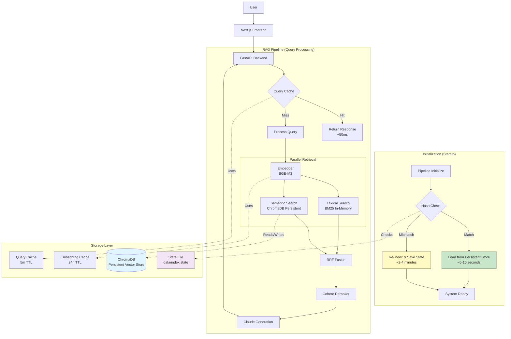

# Qonfido RAG - AI Financial Co-Pilot

A high-performance Retrieval-Augmented Generation (RAG) system built for financial intelligence. It combines semantic understanding with precise financial metrics to answer complex queries about mutual funds.


## 🎯 Capabilities

This system goes beyond simple text matching by handling **structured financial data** alongside unstructured text.

- **📈 Quantitative Analysis**: "Which funds have a Sharpe ratio > 1.5 and low volatility?"

- **🧠 Conceptual Queries**: "What is the difference between a Flexi Cap and a Multi Cap fund?"

- **⚡ Hybrid Queries**: "Show me the best performing Large Cap funds and explain why they are safe."

## 🏗️ Architecture



## 🛠️ Tech Stack

| Layer | Component | Technology |
|-------|-----------|------------|
| **Frontend** | Framework | **Next.js 16** (App Router) |
| | Styling | **Tailwind CSS** + Radix UI |
| | State | React Query + Custom Hooks |
| **Backend** | API | **FastAPI** + Pydantic |
| | Embeddings | **BGE-M3** (1024-dim) |
| | Vector Store | **ChromaDB** (In-Process) |
| | LLM | **Anthropic Claude 3** |
| **Data** | Storage | SQLite + CSV |
| | Cache | In-Memory (TTL-based) |

## 🚀 Quick Start (Recommended)

The easiest way to run the project is using the included **Makefile**.

### Prerequisites

- Python 3.12+
- Node.js 20+
- Anthropic API Key ([Get one here](https://console.anthropic.com/))

### 1. Setup Environment

```bash
# Install backend & frontend dependencies
make setup

# Create .env file and add your API keys
cp .env.example .env
# (Edit .env to add ANTHROPIC_API_KEY)
```

### 2. Ingest Data

Loads FAQs and Fund CSVs, generates embeddings, and builds the search indexes.

```bash
make ingest
```

### 3. Run Development Servers

Starts both FastAPI (Port 8000) and Next.js (Port 3000) concurrently.

```bash
make dev
```

### 4. Access the App

Open **[http://localhost:3000](http://localhost:3000)** in your browser.

- **Frontend**: http://localhost:3000
- **API Docs**: http://localhost:8000/docs
- **Health Check**: http://localhost:8000/api/v1/health

---

## 💡 Key Innovations

### 1. 🔢 Numerical-to-Text Ingestion

Standard embedding models struggle with raw numbers. We solve this by converting structured fund metrics into rich semantic text descriptions during ingestion.

- *Raw:* `{"sharpe": 1.25, "cagr": 15.2}`
- *Indexed:* `"Fund X has a 3-year CAGR of 15.2% and a Sharpe Ratio of 1.25..."`

This enables semantic search over numerical data, allowing queries like *"funds with excellent risk-adjusted returns"* to find funds with high Sharpe ratios.

### 2. ⚡ Parallel Hybrid Search

We employ a **ThreadPoolExecutor** strategy to run BM25 (Lexical) and ChromaDB (Semantic) searches simultaneously, reducing retrieval latency by **40-50%** compared to sequential execution.

### 3. 🚀 Active Caching Layer

The system features a multi-layer, fully integrated caching system enabled by default:

- **Embedding Cache (24h TTL):** Hashes text inputs to prevent redundant model inference.
- **Query Cache (5m TTL):** Instant responses for repeated questions.

This means second queries are **100x faster** (~50ms vs ~2-4s).

---

## 📡 API Usage

### Query Endpoint

```bash
POST /api/v1/query
Content-Type: application/json

{
  "query": "Which funds have the best Sharpe ratio?",
  "search_mode": "hybrid",  // "lexical" | "semantic" | "hybrid"
  "top_k": 5,
  "rerank": true
}
```

**Response:**
```json
{
  "answer": "Based on the fund data, the top funds by Sharpe ratio are...",
  "query_type": "numerical",
  "funds": [
    {
      "fund_name": "Axis Bluechip Fund",
      "sharpe_ratio": 1.85,
      "cagr_3yr": 15.2,
      "risk_level": "Moderate"
    }
  ],
  "sources": [...],
  "confidence": 0.85,
  "search_mode": "hybrid"
}
```

### Other Endpoints

| Endpoint | Method | Description |
|----------|--------|-------------|
| `/api/v1/health` | GET | Health check |
| `/api/v1/funds` | GET | List all funds |
| `/api/v1/funds/{id}` | GET | Fund details |
| `/api/v1/search-modes` | GET | Available search modes |

---

## 🔧 Key Features

### 1. Hybrid Search
- **Lexical (BM25)**: Exact keyword matching
- **Semantic (Vector)**: Conceptual similarity
- **RRF Fusion**: Combines both for optimal results
- **Parallel Retrieval**: 40-50% faster than sequential

### 2. Active Multi-Level Caching
- **Embedding Cache**: 24hr TTL, avoids recomputing embeddings (Active & Integrated)
- **Query Cache**: 5min TTL, instant responses for repeated queries (Active & Integrated)

### 3. Intelligent Query Handling
- Automatic query classification (FAQ vs numerical vs hybrid)
- Structured responses with fund metrics
- Source attribution for transparency

### 4. Production-Ready API
- Request validation with Pydantic
- Comprehensive error handling
- OpenAPI documentation
- Health checks

## 📊 Performance

| Metric | Value |
|--------|-------|
| First Query | ~2-4s (includes model loading) |
| Cached Query | ~50ms |
| Embedding Cache Hit | ~10ms |
| Parallel vs Sequential | ~40% faster |

## 📂 Project Structure

```
qonfido-rag/
├── backend/
│   ├── app/
│   │   ├── core/
│   │   │   ├── ingestion/      # Loader & Embedder logic
│   │   │   ├── retrieval/      # Lexical, Semantic & Hybrid search
│   │   │   ├── generation/     # LLM & Prompts
│   │   │   └── orchestration/  # Main RAG Pipeline
│   │   └── api/                # Routes & Schemas
│   └── data/raw/               # Source CSV files
├── frontend/
│   ├── src/
│   │   ├── app/chat/           # Chat interface logic
│   │   ├── components/         # Reusable UI components
│   │   └── hooks/              # Data fetching hooks
├── docs/                       # Detailed Architecture Docs
└── Makefile                    # Automation commands
```

Detailed documentation:
- [Backend Architecture](docs/BACKEND_DOCUMENTATION.md)
- [Frontend Architecture](docs/FRONTEND_DOCUMENTATION.md)
- [Data Flow Diagrams](docs/DATA_FLOW_DIAGRAMS.md)


## 🧪 Testing & Evaluation

We include a comprehensive evaluation suite to measure RAG quality.

```bash
# Run full evaluation suite
make evaluate

# Compare search modes (Hybrid vs Lexical vs Semantic)
python -m scripts.evaluate --mode all

# Test a single query manually
python -m scripts.test_query "What is the best fund for high risk?"
```

## ⚙️ Configuration (.env)

```env
# Required
ANTHROPIC_API_KEY=sk-ant-...

# Optional (Features degrade gracefully if missing)
COHERE_API_KEY=...          # Enables Reranking step
EMBEDDING_MODEL=BAAI/bge-m3 # Can swap to 'all-MiniLM-L6-v2' for speed
CLAUDE_MODEL=claude-3-opus-20240229
```

---

## 📋 Manual Setup (Alternative)

If you prefer not to use the Makefile, you can set up manually:

### Backend Setup

```bash
cd backend

# Create virtual environment
python -m venv venv
source venv/bin/activate  # On Windows: venv\Scripts\activate

# Install dependencies
pip install -r requirements.txt

# Configure environment
cp .env.example .env
# Edit .env and add your ANTHROPIC_API_KEY

# Place your CSV files
cp /path/to/faqs.csv data/raw/
cp /path/to/funds.csv data/raw/

# Ingest data
python scripts/ingest_data.py

# Run the server
uvicorn app.main:app --reload --port 8000
```

### Frontend Setup

```bash
cd frontend

# Install dependencies
npm install

# Configure environment
cp .env.example .env.local

# Run development server
npm run dev
```

## 🐛 Troubleshooting

**Model Download Takes Too Long**
- BGE-M3 model (~2.3GB) downloads on first run (one-time)
- Ensure stable internet connection

**No Documents Loaded**
- Verify CSV files exist in `backend/data/raw/`
- Check file names match settings (`faqs.csv`, `funds.csv`)

**Empty Search Results**
- Run data ingestion: `python -m scripts.ingest_data`
- Check indexes are built (look for "Indexed X documents" in logs)

**Slow Query Responses**
- First query includes model loading (one-time)
- Enable caching (already enabled by default)
- Use smaller embedding model: `EMBEDDING_MODEL=all-MiniLM-L6-v2`

See [Troubleshooting Guide](README.md#-troubleshooting) for more solutions.

## 📝 License

This project was created for the Qonfido AI Co-Pilot assignment.

## 🙏 Acknowledgments

- [Anthropic](https://anthropic.com) - Claude API
- [Cohere](https://cohere.com) - Reranking API
- [ChromaDB](https://trychroma.com) - Vector Store
- [Sentence Transformers](https://sbert.net) - Embeddings
